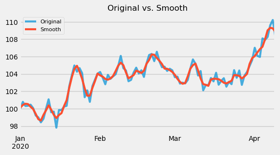

# Auto Smooth

Apply data smoothing/filtering to a time series by automatically selecting parameters.

Currently available smoothing/filtering techniques in the package:
- Savitzky–Golay filter 

## Quickstart

```python
from auto_smooth import auto_savgol

# apply savgol filter
data_filtered = auto_savgol(data)

>>> wl_best= 7, po_best= 2
```



## Savitzky-Golay Filtering

Savitzky–Golay (Abraham Savitzky and Marcel J. E. Golay) filter is a type of low-pass filter used for smoothing noisy data.[^1] It is based on local least-squares fitting[^2].

`auto_savgol` method applies a Savitzky–Golay filter using the [scipy](https://docs.scipy.org/doc/scipy/reference/generated/scipy.signal.savgol_filter.html) `savgol_filter()` method.


```python
from auto_smooth import auto_savgol

# apply savgol filter
data_filtered = auto_savgol(data)

# pass window-length and polynomial order parameters
data_filtered = auto_savgol(data, wl_min=10, wl_max=30, po_min=2, po_max=10)
```

## References

[^1]: https://scipy-cookbook.readthedocs.io/items/SavitzkyGolay.html
[^2]: https://pubs.acs.org/doi/10.1021/acsmeasuresciau.1c00054
- [Smoothing and Differentiation of Data by Simplified Least Squares Procedures](https://agora.cs.wcu.edu/~huffman/figures/sgpaper1964.pdf)
- [Scipy savgol filter](https://docs.scipy.org/doc/scipy/reference/generated/scipy.signal.savgol_filter.html)
- [Savitzky–Golay](https://en.wikipedia.org/wiki/Savitzky–Golay_filter)
- [Convolution](https://en.wikipedia.org/wiki/Convolution)
- [What Is a Savitzky-Golay Filter?](https://inst.eecs.berkeley.edu/~ee123/sp18/docs/SGFilter.pdf)
